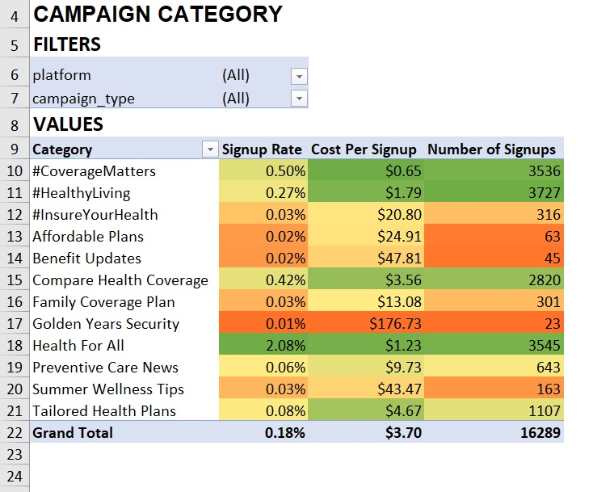
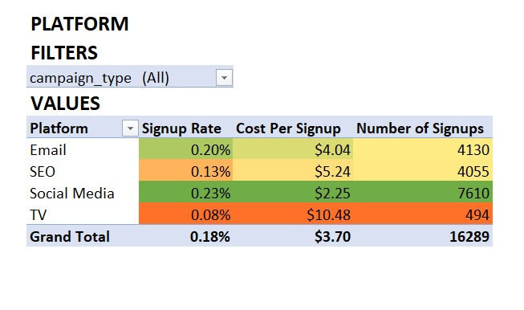
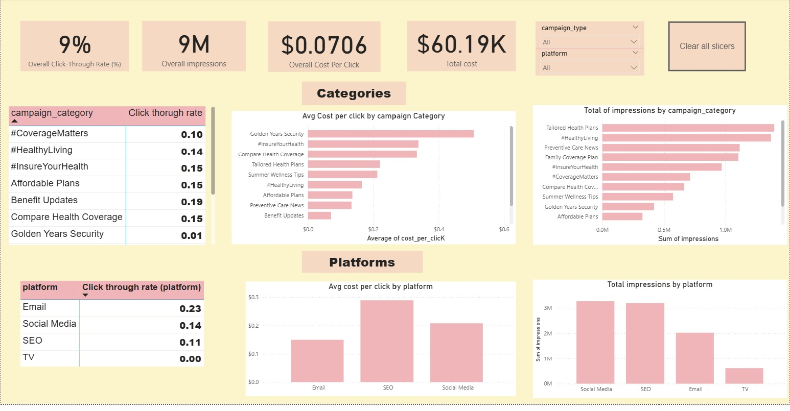

# Ro_health-wellness-program-analysis
I analyzed Row Health’s Wellness Reimbursement program data, delivering insights into claims and marketing campaign performance. This repo contains SQL queries, Excel analyses, and a Power BI dashboard to visualize key metrics supporting data-driven decisions for improving program outcomes and customer acquisition.

## Table of Contents
- [Project Summary](#project-summary)
- [Summary Insights](#summary-insights)
- [Marketing Campaign Insights](#marketing-campaign-insights)
- [Recommendations](#recommendations)

---

## Project Summary

Row Health is an innovative healthcare company focused on providing holistic wellness solutions and insurance products to customers across the United States. The company runs a Wellness Reimbursement program that subsidizes wellness products to encourage healthier lifestyles among its members.

In this project, I act as a data analyst supporting the Claims and Marketing teams. My role involves analyzing customer claims data and marketing campaign metrics to deliver actionable data strategies and insights. These insights aim to optimize program performance, enhance customer acquisition efforts, and increase brand awareness through data-driven decision making.

---

## Summary Insights

Using SQL, I provided summary insights to answer questions from the Claims department. These insights focus on product performance, customer behavior, regional trends, financial metrics, and operational considerations within the Wellness Reimbursement program.

The most frequently claimed products consistently from 2019 through early 2023 are Hair Growth Supplements and Vitamin B+ Advanced Complex. Hair Growth Supplements averaged around 200-500 claims per month, while Vitamin B+ Advanced Complex maintained strong claim volumes with slightly lower frequency but higher claim value.

In 2023, Detox + Debloat Vitamin led total claim amounts with approximately $286,551, and had the highest average claim amount at about $326 per claim. Hair Growth Supplements and Vitamin B+ Advanced Complex had the highest claim counts with 2,732 and 1,754 claims respectively. However, Vitamin B+ Advanced Complex's average claim amount was roughly $130, substantially higher than Hair Growth Supplements’ average of $33, resulting in a larger total claim amount overall.

Other products like SuperYou Natural Stress Relief and Hair Vitamins Trio showed high average claim amounts of approximately $332 and $184 respectively, though with moderate total claim amounts, signaling their high value but less frequent usage.

Trends over time reveal Detox + Debloat Vitamin steadily increasing in monthly claims and total claim amounts from 2019 to 2023, consistently with average claims between $300 and $340. Hair Growth Supplements maintain steady monthly claim volumes, and Hair Vitamins Trio shows growing claim counts and total amounts in recent years. Vitamin B+ Advanced Complex exhibits a steady upward trend with average claim amounts around $120–$135.

Key customer behavior analysis shows top claimants by claim frequency and total claim value, with average time between multiple claims suggesting repeat usage (figures available on detailed reports).

Regionally, New Jersey (NJ) consistently reports the highest number of claims and total claim amounts annually from 2019-2023, making it the region with the largest claim volume and value. States such as New York (NY), North Dakota (ND), Iowa (IA), and Washington (WA) rank highly as well, indicating other significant areas of claims activity.

Average claim amounts vary by state and year; states like Tennessee (TN), Mississippi (MS), Florida (FL), Arizona (AZ), and Minnesota (MN) had higher averages in early years (e.g., TN around $198 and MS around $189 in 2019). Later years show spikes in states like Massachusetts (MA), Maryland (MD), and Oregon (OR), where average claims reached above $225–$360 depending on the year.

Program usage patterns highlight customers upgrading to premium plans and submitting claims afterward, with key second-product purchases dominated by Vitamin B+ Advanced Complex.

The overall coverage ratio (covered claim amount divided by total claim amount) averages around 0.61 (61%) across all products. Product-level coverage ratios vary, with Biotin Supplement and Hair and Nail Wellbeing having the highest ratios at about 0.68 and 0.65, respectively.

---

## Marketing Campaign Insights

I used SQL and Excel to perform further technical analysis to evaluate the performance of Row Health’s marketing campaigns in terms of customer acquisition and brand awareness, utilizing metrics across campaign categories and platforms.

### Customer Acquisition Highlights

The most successful campaign was Health For All, which achieved a standout signup rate of 2.08% and generated 3,545 new signups. This campaign led all categories in terms of efficiency and reach.

One of the most cost-effective campaigns was #CoverageMatters, with a low cost per signup of just $0.65 and delivering 3,536 signups. This reflects a highly efficient marketing spend.

The #Healthyliving campaign also performed strongly, securing 3,727 signups with a competitive cost per signup (~$1.88) and solid engagement rates.

### Platform Performance

Social Media emerged as Row Health’s most valuable acquisition channel, contributing approximately 7,610 signups with a moderate average cost per signup ($205.65), showcasing wide reach and audience engagement.

Email campaigns accounted for 4,130 signups and maintained the lowest cost per signup ($123.22) among all platforms—a strong balance of cost-efficiency and effectiveness.

SEO delivered 4,055 signups but averaged a higher acquisition cost ($289.54 per signup), suggesting opportunities for further optimization.

Television was the least effective platform, yielding just 494 signups at a high cost per signup ($3.35), indicating poor ROI compared to other channels.

### Brand Awareness Metrics

The platform-level click-through rate (CTR) was highest for Email (16.7%), followed by Social Media (8.6%) and SEO (7.3%); TV performed poorly with a 0% CTR.

Across campaign categories, top performers included Benefit Updates (22.2% CTR), Summer Wellness Tips (18.1% CTR), and Compare Health Coverage (14.0% CTR), highlighting audience interest in wellness and benefits-focused content.

Campaigns such as Family Coverage Plan and Golden Years Security had very low CTRs (0% and 1.4%, respectively), flagging areas needing strategic review.

---

## Recommendations

Based on my analysis, here are some of the actions I would recommend taking in areas of customer acquisition, driving product growth, and optimizing performance in terms of platform costs and advertising spend:

### Claims Program:

- **Focus on High-Performing Products:** Prioritize marketing and support efforts for consistently high-demand products like Hair Growth Supplements and Vitamin B+ Advanced Complex. Consider tailored promotions or educational campaigns to boost uptake of high-value but moderately claimed products such as Detox + Debloat Vitamin and SuperYou Natural Stress Relief. Our email marketing campaign worked really well; we can try to push these tailored recommendations here.

- **Target Regional Opportunities:** New Jersey leads in both claim volume and total claim amount. Strengthen outreach and claims support in this region and other high-activity states like New York, Iowa, and Washington to sustain growth and increase our customer base steadily in areas where we have brand presence.

- **Improve Coverage Ratios:** With an overall claim coverage ratio of 61%, exploring opportunities to increase coverage through policy optimizations or product adjustments, especially for products with lower coverage ratios, would help boost consumer confidence and can drive an increase in signups.

### Marketing Campaigns

- **Scale High-Impact Campaigns:** Increase investment in campaigns like Health For All and CoverageMatters that demonstrated high signup rates (2.08%) and low costs per signup ($0.65), respectively. These campaigns effectively convert impressions into signups and provide strong ROI.

- **Leverage Effective Platforms:** Focus on Social Media and Email channels, which deliver significant signups (7,610 and 4,130 respectively) at reasonable costs. Optimize SEO campaigns to lower acquisition costs, and reevaluate the role of Television, which shows poor cost-efficiency and very low signup volumes.

- **Enhance Brand Awareness Content:** Strengthen content for well-performing campaign categories such as Benefit Updates, Summer Wellness Tips, and Compare Health Coverage which achieved high click-through rates (above 14%). Use educational and testimonial-driven content that builds trust and engagement.

- **Personalize Messaging and Targeting:** Adopt audience segmentation based on demographics, location, and engagement data to deliver personalized messages, improving both signup rates and retention. A further analysis in customer retention and churn rate might help to identify customers at higher risk of leaving, allowing us to tailor our programs to these customers.

